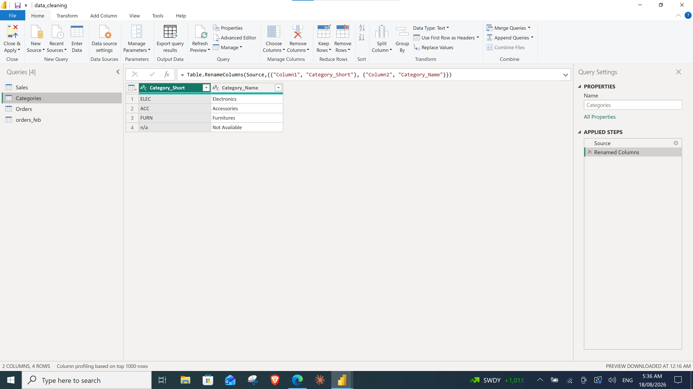
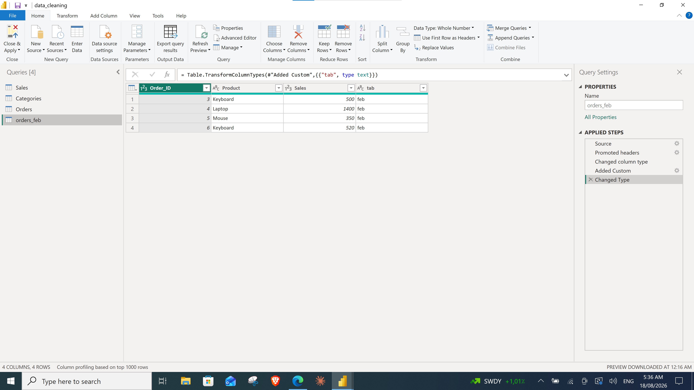

# 🧹 Power BI — Data Cleaning & Order Processing

A hands-on Power BI project demonstrating a **structured, repeatable data cleaning workflow** in Power Query. The project takes messy, real-world-style CSV data and transforms it into a clean, analysis-ready data model through a clear 6-step process.

---

## 📌 Why This Project?

Most beginners approach data cleaning without a plan — jumping randomly between steps like trimming text, changing types, removing columns, and replacing values. This leads to confusion and unreliable results.

This project follows a **clear, structured methodology** instead:


---

## 🗂️ Repository Structure

```
data_clening_order/
├── data/                   # Source CSV files
│   ├── orders_jan.csv
│   ├── orders_feb.csv
│   ├── sales_flattable.csv
│   └── sales_monthly.csv
├── docs/                   # Detailed documentation
│   └── data_cleaning_guide.md
├── screenshots/            # Power Query result screenshots
│   ├── 1-sales 1.jpg
│   ├── 1-sales 2.jpg
│   ├── categories.jpg
│   ├── orders.jpg
│   └── orders_feb.jpg
├── post/                   # Visual step-by-step workflow diagrams
├── .gitignore
├── LICENSE
├── README.md
└── data_cleaning.pbix      # Power BI Desktop file
```

---

## 📊 Datasets

### `sales_flattable.csv` — Main transactional data
A deliberately messy dataset containing common real-world data quality issues:

| Issue | Example |
|---|---|
| Special characters in names | `#ANna`, `#Jean`, `#Claire` |
| Inconsistent casing | `ScHmidt`, `MARTIN`, `DIAZ` |
| Extra whitespace | `"   Luca"`, `"Sofia  "`, `"carlos@email.com "` |
| Missing values | Empty `Amount`, empty `Price`, blank `Email` |
| Completely empty rows | Rows 9, 12, 14 |
| Duplicate records | Row 1 and Row 7 are identical orders |
| Invalid dates | `D2024-99-13` |
| Compound fields | `"Laptop Pro | ELEC"` (product + category in one column) |
| Technical/system columns | `SYS-88721-XZ` (not useful for analysis) |

### `sales_monthly.csv` — Aggregated monthly data
Customer-level monthly sales and cost figures for January, February, and March.

### `orders_jan.csv` & `orders_feb.csv` — Monthly order files
Separate transactional files per month that need to be combined into a single Orders table.

---

## 🔧 The 6-Step Data Cleaning Workflow

### Step 1 — Connect Data

Import the source tables into Power Query from their respective CSV files.


**Queries created:**
| Query | Source File |
|---|---|
| Sales | `sales_flattable.csv` |
| Categories | *(manually created lookup table)* |
| Orders | `orders_jan.csv` |
| orders_feb | `orders_feb.csv` |

---

### Step 2 — Filter Data

Reduce the dataset to only relevant rows and columns **before** doing any transformations. This improves performance and keeps the workflow clean.


**Operations performed on Sales:**
- ✅ Removed unnecessary columns (e.g., `Technical_Log_ID`)
- ✅ Removed completely blank rows
- ✅ Removed duplicate rows

---

### Step 3 — Clean Data

Fix data quality problems — standardize text, handle missing values, and eliminate duplicates.


**Text cleaning:**
- `Trim Text` — Remove leading/trailing whitespace
- `Lowercase Text` — Normalize casing
- `Capitalize Each Word` — Proper case for names

**Value cleaning:**
- `Replace Values` — Fix known bad values (e.g., `#` prefix, `n/a`)
- `Replace Errors` — Handle formula errors gracefully

**Duplicate handling:**
- `Remove Duplicates` — Eliminate repeated records

**Example transformation:**
| Before | After |
|---|---|
| `#ANna` | `Anna` |
| `" John "` | `John` |
| `SCHMIDT` | `Schmidt` |
| `null` / `error` | *(replaced or removed)* |

---

### Step 4 — Transform Data

Reshape and restructure columns — split compound fields, extract substrings, assign correct data types, and create new calculated columns.


**Data types:**
- `Order_Id` → Whole Number
- `Sales` → Whole Number
- `Category` → Text

**Split columns:**
- `Product_Info` (`"Laptop Pro | ELEC"`) → split by `|` delimiter into `Product_Name` + `Category`

**Extract text:**
- `Extracted Last Characters` — country code from `Customer_ID` (e.g., `DE` from `C-1001-DE`)
- `Extracted Text After Delimiter` — additional field parsing

**Add custom column:**
- In `Orders` and `orders_feb`: added a `Tab` column (`jan` / `feb`) to identify the source month

**Rename columns:**
- `Column1` → `Category_Short`
- `Column2` → `Category_Name`
- `Order_ID` → `Order_Id`

---

### Step 5 — Combine Data

Integrate multiple tables into unified datasets using Append (union rows) and Merge (join columns).


**Append Queries:**
- `Orders` + `orders_feb` → Combined Orders table (January + February in one table)

**Merge Queries:**
- `Sales` merged with `Categories` on `Category_Short` to enrich Sales with full category names
- Then expanded the merged `Categories` column to bring `Category_Name` into Sales

```
Sales
   │
   ├── Category_Short (e.g., "ELEC")
   │
   ▼
Merge with Categories
   │
   ▼
Expand → Category_Name (e.g., "Electronics")
```

> **💡 Note:** The order of combine vs. clean steps matters. This project uses two common Power Query flows:


---

### Step 6 — Clean Up

Final preparation — remove helper columns, standardize names, and arrange columns in a logical business order.


**Operations:**
- ✅ Remove unnecessary/helper columns
- ✅ Rename columns to a consistent naming convention
- ✅ Reorder columns in logical business order

**Final Sales column order:**

| # | Column |
|---|---|
| 1 | `Order_Id` |
| 2 | `Product_Name` |
| 3 | `Category` |
| 4 | `Category_Name` |
| 5 | `Customer_ID` |
| 6 | `Customer_Name` |
| ... | *(remaining business fields)* |

---

## 📸 Final Results in Power Query

### Sales Query (Applied Steps & Final Output)


### Categories Lookup Table



### Combined Orders Table


### orders_feb (Staging Query)



---

## 📋 Query Summary

| Query | Applied Steps |
|---|---|
| **Sales** | Source → Promoted Headers → Changed Type → Removed Columns → Removed Blank Rows → Removed Duplicates → Trimmed Text → Replaced Values → Capitalized Each Word → Lowercased Text → Changed Type → Replaced Errors → Split Column by Delimiter → Extracted Last Characters → Extracted Text After Delimiter → Merged Queries → Expanded Categories → Renamed Columns → Reordered Columns |
| **Categories** | Source → Renamed Columns |
| **Orders** | Source → Promoted Headers → Changed Type → Added Custom (`Tab`) → Changed Type → Appended Query (`orders_feb`) → Removed Duplicates → Reordered Columns → Renamed Columns |
| **orders_feb** | Source → Promoted Headers → Changed Type → Added Custom (`Tab`) → Changed Type |

---

## 🔄 End-to-End Workflow Diagram

```
SOURCE DATA (CSV files)
     │
     ▼
① CONNECT DATA
     │
     ├── Sales (sales_flattable.csv)
     ├── Categories (lookup)
     ├── Orders (orders_jan.csv)
     └── orders_feb (orders_feb.csv)
     │
     ▼
② FILTER DATA
     │
     ├── Remove unnecessary columns
     ├── Remove blank rows
     └── Remove irrelevant records
     │
     ▼
③ CLEAN DATA
     │
     ├── Remove duplicates
     ├── Trim text
     ├── Standardize capitalization
     ├── Replace invalid values
     └── Replace errors
     │
     ▼
④ TRANSFORM DATA
     │
     ├── Change data types
     ├── Split columns by delimiter
     ├── Extract text (last chars, after delimiter)
     ├── Add custom columns (Tab)
     └── Standardize column names
     │
     ▼
⑤ COMBINE DATA
     │
     ├── Append: Orders + orders_feb
     ├── Merge: Sales + Categories
     └── Expand merged data
     │
     ▼
⑥ CLEAN UP
     │
     ├── Remove unnecessary columns
     ├── Rename columns
     └── Reorder columns logically
     │
     ▼
✅ CLEAN & READY DATA
     │
     ▼
📊 POWER BI DATA MODEL / ANALYSIS
```

---

## 🛠️ Tools Used

- **Power BI Desktop** — Report building and data modeling
- **Power Query (M Language)** — All data cleaning and transformation

## 📄 License

This project is licensed under the [MIT License](LICENSE).
